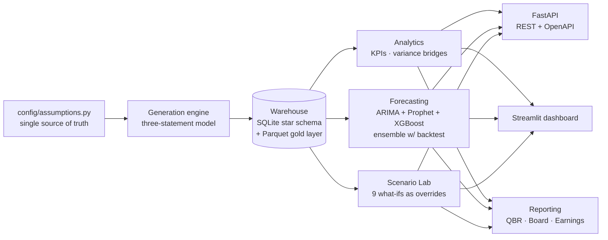
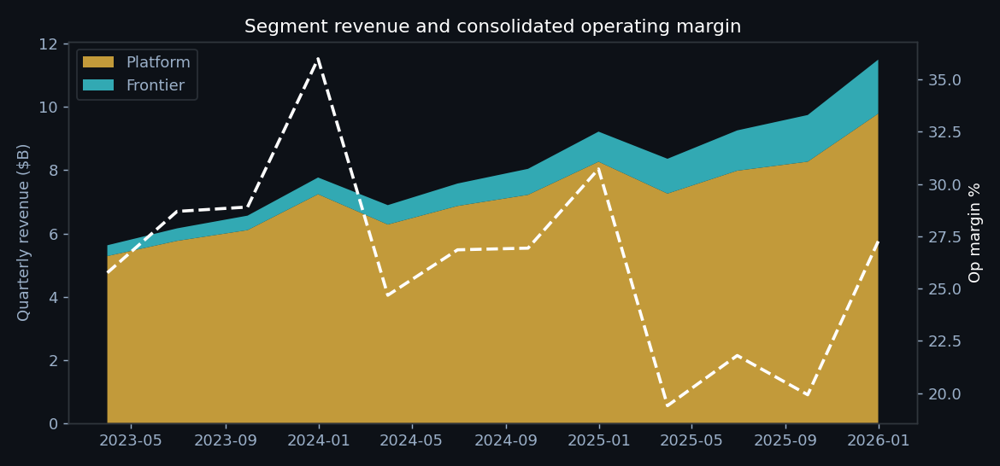
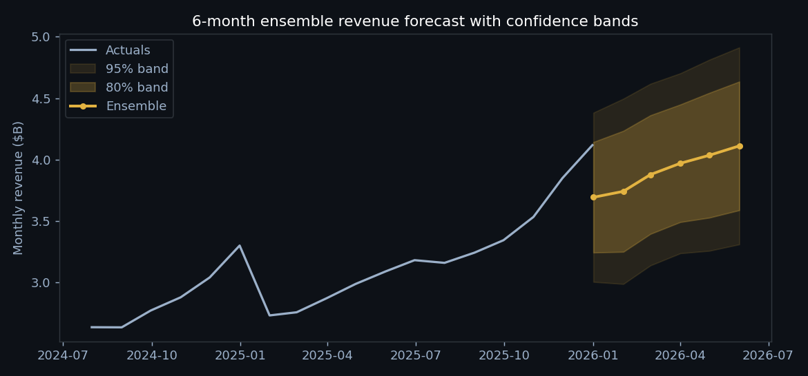
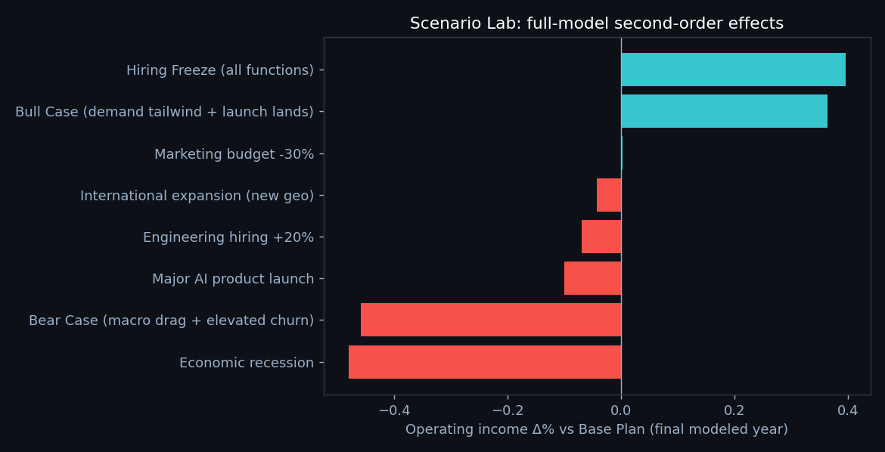

# HELIOS — CFO Digital Twin

**A working simulation of a company's financial engine: a fully articulated three-statement model you can forecast, stress-test, and turn into board-ready reports with one command.**


## What is this?

HELIOS is a digital twin of a fictional technology company's finance function. Instead of a static spreadsheet, the entire business is expressed as a driver-based operating model in code: users, ARPU, headcount, marketing response curves, and infrastructure costs flow into a fully linked P&L, balance sheet, and cash flow statement. Net income rolls into retained earnings, the indirect cash flow reconciles to the balance sheet cash line, and the balance sheet balances by construction, not by a plug (max imbalance across 36 months: $0.00003).

The modeled company has two segments built to create genuine financial tension. **Platform** is the mature cash engine: advertising plus a growing cloud business, high margin, predictable. **Frontier** is the moonshot: AR and AI devices, heavy R&D, negative operating margin, justified entirely by option value. Platform funds Frontier, and every quarter that arrangement gets more expensive.

That tension is the point. Consolidated operating margin compresses from 30.3% (FY2023) to 22.4% (FY2025) while the core business gets *stronger*: Platform operating income grows from $12.1B to $14.7B, but Frontier losses grow faster, from -$4.2B to -$6.0B. A dashboard shows you that margin fell. A digital twin lets you ask what happens if you cut the burn, freeze hiring, or hit a recession, and shows you the second-order effects.

## Why it's useful

This maps directly onto the central problem of strategic finance at any large tech company: **capital allocation between a cash cow and a growth bet.** How long can Platform fund Frontier? What does a marketing cut do to next year's cloud revenue, not just this quarter's opex? What does the recession case do to cash runway?

The system demonstrates, end to end:

**Three-statement modeling** (fully linked, segment-level, balances by construction) · **Driver-based planning** (every scenario is an assumption override, and second-order effects propagate through the whole model) · **Variance analysis** (price/volume/mix bridges) · **Ensemble forecasting** (ARIMA + Prophet + XGBoost, weighted by walk-forward backtest, with confidence bands) · **Data warehousing** (star schema in SQLite, gold layer in Parquet) · **API design** (typed FastAPI with OpenAPI docs) · **Executive communication** (auto-generated QBR, board memo, and earnings summary written from the actual numbers).

## Architecture



## Quickstart

From clone to running dashboard in under two minutes:

```bash
git clone https://github.com/YOUR_USERNAME/helios-cfo-digital-twin.git
cd helios-cfo-digital-twin
make install        # pip install -r requirements.txt
make warehouse      # generate the company + build the star schema
make app            # launch the dashboard at http://localhost:8501
```

Other entry points:

```bash
make reports        # regenerate QBR, board memo, earnings summary -> reports/
make forecast       # run the ensemble + backtest from the CLI
make scenarios      # scenario comparison table
make api            # FastAPI at http://localhost:8000 (docs at /docs)
make test           # 17 pytest checks: accounting integrity, pipeline, API schemas
```

## How to use it

1. **Pick a scenario.** In the dashboard sidebar, switch from Base Plan to Bear Case. Every chart reruns off the full three-statement model for that scenario, so you see margin, cash, and headcount move together, not one hardcoded chart.
2. **Read the forecast bands.** The Command Center shows a 6-month ensemble revenue forecast. The shaded regions are ~80% and ~95% confidence bands, sized from backtest residuals and widened where the member models disagree. Wide bands are information, not decoration.
3. **Open the Scenario Lab.** Compare all nine what-ifs against Base Plan. Note the second-order effects: the marketing cut *raises* operating income this year and *lowers* revenue next year, because logo adds feed forward into cloud revenue.
4. **Generate a board pack.** `make reports` writes a QBR, a board memo, and an earnings summary into `reports/`, narrated from the live numbers. Change an assumption, rebuild, and the narrative changes with it.

## Dashboard





*Charts rendered from the same warehouse data the dashboard serves.*

## Tech stack and project structure

Python 3.11 · pandas · SQLite + Parquet · statsmodels (ARIMA) · Prophet · XGBoost · FastAPI + Pydantic · Streamlit + Altair · pytest · GitHub Actions

```
helios-cfo-digital-twin/
├── config/
│   └── assumptions.py        # every driver and scenario knob lives here
├── src/
│   ├── generation/model.py   # three-statement engine (P&L -> BS -> CF)
│   ├── warehouse/            # ETL -> SQLite star schema + Parquet gold
│   ├── analytics/            # KPI suite + price/volume/mix variance bridges
│   ├── forecasting/          # ensemble pipeline w/ walk-forward backtest
│   ├── scenarios/            # scenario library + comparison engine
│   └── narration/            # CFO assistant + QBR/board/earnings generators
├── api/main.py               # FastAPI service
├── app/streamlit_app.py      # interactive dashboard
├── sql/schema.sql            # star schema DDL
├── tests/                    # accounting integrity, pipeline, API schemas
├── reports/                  # generated QBR, board memo, earnings summary
├── docs/                     # architecture deep-dive + skills mapping
└── Makefile                  # one-command everything
```

## Docs

- [`docs/architecture.md`](docs/architecture.md) — data flow, star schema design, and the tie-out math that keeps the statements honest
- [`docs/skills_mapping.md`](docs/skills_mapping.md) — each component mapped to the FP&A / strategic-finance competency it demonstrates

## Deploying a live demo

See [`docs/deploy.md`](docs/deploy.md) for step-by-step instructions (Streamlit Community Cloud, free tier, ~5 minutes).

## License

MIT
